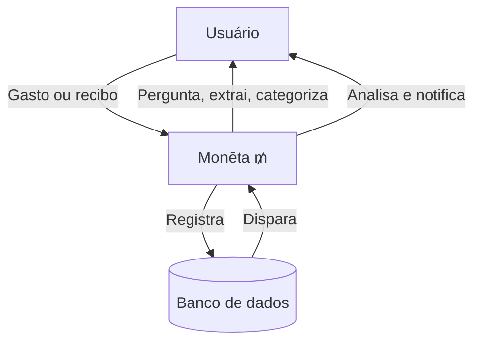
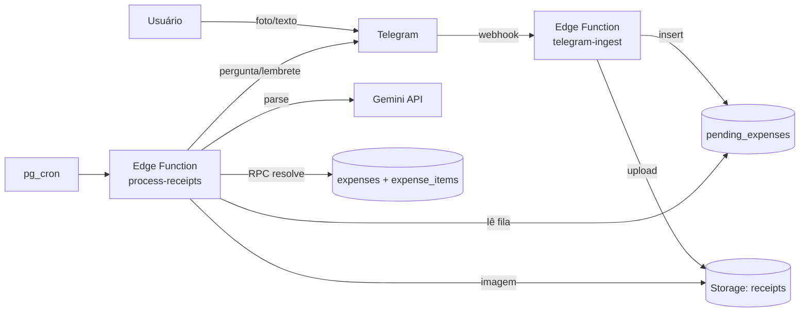

# Monēta ₥

Monēta é um assistente financeiro pessoal conversacional. Você envia recibos por imagem ou descreve gastos em texto, e ela extrai, categoriza e salva tudo automaticamente.

> Epíteto de Juno, Monēta é a deusa romana que guardava o templo onde o dinheiro de Roma era cunhado — seu nome é a raiz etimológica de moeda, _money_ e _mint_. Era ela quem advertia, quem lembrava, quem mantinha as contas do império em ordem.

**Status (2026-09-11)**: backend completo — schema com categorias, auditoria e analytics; bot do Telegram funcional (122+ recibos na fila, 109+ despesas processadas); fluxo `/revisar` com sugestão automática de categoria. Próximo: app UI e análise semanal autônoma.

## Princípios

- **Vigilância** — nenhum gasto passa despercebido: recibos, anotações, parcelas futuras e padrões invisíveis ao olho humano. Ela não julga; ela registra, organiza e devolve clareza.
- **Ponderação** — não basta saber quanto você gastou, é preciso entender se faz sentido, se é sustentável, se existe um padrão que trabalha contra você. Monēta transforma números em perguntas que valem a pena responder.
- **Advertência** — como a Juno que alertava Roma antes das tempestades, Monēta avisa antes que o problema chegue, seja um orçamento prestes a estourar, uma parcela esquecida, um mês mais pesado do que o normal. A advertência é um presente.

## Contexto e propósito

## Escopo

- Categorização e subcategorização por taxonomia própria
- Detecção de duplicatas e enriquecimento de registros existentes
- Controle de parcelas e projeção de gastos futuros
- Análise semanal autônoma com detecção de padrões
- Sugestões de economia baseadas no histórico
- Alertas de orçamento por categoria
- Notificações via Telegram
- Integração futura com Open Finance Brasil e importação OFX

## Arquitetura atual

Tudo roda dentro do Supabase — sem servidor separado:

Essa arquitetura substituiu o plano original (FastAPI no Render + frontend Vite no Vercel) — Edge Functions cobrem o webhook do Telegram, o agendamento (pg_cron) e as operações atômicas (RPC) sem infraestrutura extra. Detalhes em [`docs/planejamento.md`](docs/planejamento.md).

## Premissas e restrições

**Premissas**
- Sistema de uso pessoal, um único usuário autenticado
- Usuário tem acesso estável à internet no momento do registro
- Recibos enviados como imagem têm qualidade suficiente para leitura por modelo de visão
- Categorias de gasto são estáveis e definidas previamente via seed
- O modelo de linguagem retorna JSON válido dentro do schema esperado na maioria das chamadas
- Gastos em moeda estrangeira são registrados manualmente com o valor já convertido, ou com o valor original para referência

**Restrições**
- Dados financeiros pessoais não podem ser enviados a terceiros sem consentimento explícito — todas as integrações de IA devem ser avaliadas sob a LGPD
- Imagens de recibos não devem ser armazenadas indefinidamente: política de retenção a definir antes do lançamento
- A chave de API dos modelos de linguagem não pode ser exposta no frontend
- O sistema não pode realizar transações financeiras em nome do usuário
- Integração com Open Finance Brasil exige certificação e homologação pelo Banco Central (a implementar)
- Notificações via Telegram dependem de o usuário ter uma conta ativa na plataforma
- O sistema não substitui consultoria financeira profissional

## Documentação

- [`CLAUDE.md`](CLAUDE.md) — convenções e estrutura do repositório
- [`docs/database-schema.md`](docs/database-schema.md) — referência completa do schema
- [`docs/pipeline-ia-recibos.md`](docs/pipeline-ia-recibos.md) — arquitetura da pipeline de IA
- [`docs/fluxos-interacao.md`](docs/fluxos-interacao.md) — diagramas de sequência do fluxo atual
- [`docs/automacoes-futuras.md`](docs/automacoes-futuras.md) — análise semanal e automações planejadas
- [`docs/fluxo-sessao-app-futuro.md`](docs/fluxo-sessao-app-futuro.md) — fluxo de sessão de ponta a ponta (implementado + planejado)
- [`docs/api-endpoints-futuro.md`](docs/api-endpoints-futuro.md) — endpoints do backend original, ainda não implementados
- [`docs/planejamento.md`](docs/planejamento.md) — status e prioridades
- [`supabase/README.md`](supabase/README.md) — setup das migrations
- [`supabase/functions/telegram-ingest/README.md`](supabase/functions/telegram-ingest/README.md) — setup do bot do Telegram
- [`supabase/functions/process-receipts/README.md`](supabase/functions/process-receipts/README.md) — setup do worker de processamento
