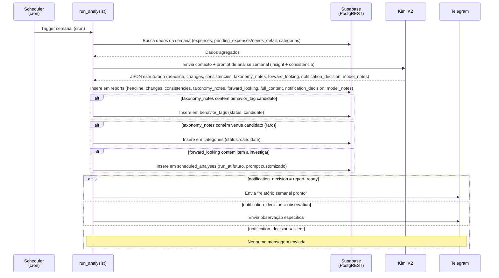
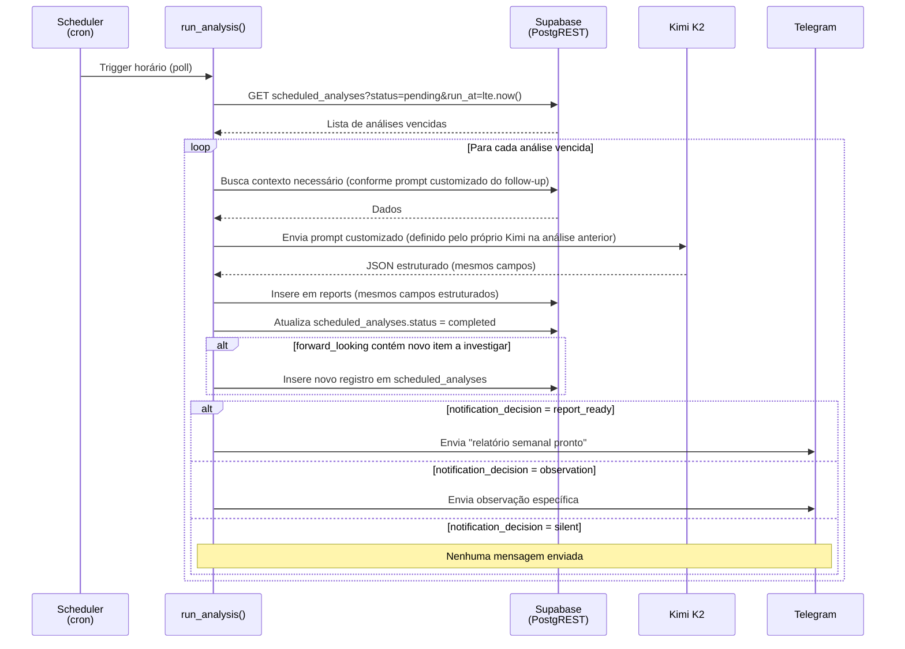

# Automações Futuras: Análise Semanal

> **Status: planejado, não implementado.** O texto abaixo descreve o desenho original da análise
> semanal, pensado para um backend FastAPI (ver [`docs/api-endpoints-futuro.md`](api-endpoints-futuro.md)).
> A arquitetura atual usa Supabase Edge Functions + `pg_cron` (sem FastAPI) — ao implementar, a
> lógica de `run_analysis()` descrita aqui deve virar uma Edge Function agendada, mantendo os
> mesmos princípios de design.

## Análise semanal

O agendamento seria interno ao processo que rodar a análise (na concepção original, um scheduler
tipo APScheduler dentro do FastAPI; na arquitetura atual seria um `pg_cron` disparando uma Edge
Function) — dois jobs, um com trigger semanal fixo e outro com polling horário sobre
`scheduled_analyses`, ambos chamando a mesma função genérica `run_analysis()`.

Kimi nunca roda SQL — nem leitura livre, nem escrita. O backend pré-agrega os dados relevantes da
semana (totais por categoria, comparação com a média móvel de 4 semanas, contagem de
`pending_expenses` com `needs_detail` acumulado) e envia tudo pronto no prompt, numa única chamada
— sem loop de tool calling, mais barato e sem superfície de validação de SQL para manter. Kimi
responde só com JSON estruturado; é `run_analysis()` quem interpreta essa resposta e decide o que
persistir — o modelo nunca tem uma tool de escrita direta.

O relatório seria armazenado em `reports` (tabela ainda não criada — ver
[`docs/database-schema.md`](database-schema.md#schema-futuro-planejado)), com campos estruturados —
`headline`, `changes`, `consistencies`, `taxonomy_notes`, `forward_looking`, `full_content`,
`notification_decision` (enum `silent` / `report_ready` / `observation`), `model_notes`. Candidatos
de `taxonomy_notes` viram novas linhas em `behavior_tags` (comportamental, proposto com frequência
normal — qualquer cluster relevante de itens) ou em `categories` (venue, proposto raramente, só em
casos extremos, já que venues devem ser estáveis). Itens de `forward_looking` que pedem
acompanhamento futuro viram novas linhas em `scheduled_analyses`, processadas pelo job de polling
horário.

Notificação via Telegram é decidida a cada execução pelo próprio `notification_decision` — não é
automática. Uma semana sem nada relevante fica `silent`; um relatório padrão pronto gera
`report_ready`; algo urgente o suficiente para não esperar gera `observation` imediata.

Categorias/tags em `status = 'candidate'` esperariam aprovação do usuário, como mensagem comum
no chat com o bot — sem endpoint novo.

## Automações agendadas (follow-ups)

