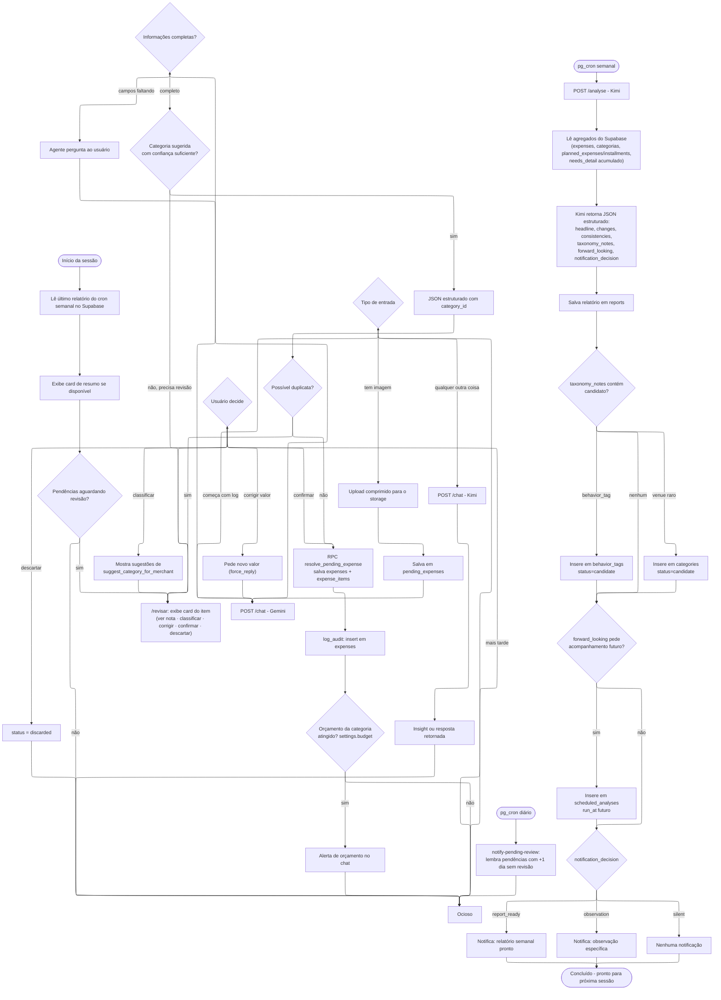

# Fluxo de Sessão do App (Planejado)

> **Status: planejado, mistura fluxo já implementado (Telegram) com features futuras** (app UI,
> orçamento por categoria, análise semanal via Kimi). Serve como visão de ponta a ponta de como
> uma sessão do usuário deve se comportar quando essas peças existirem — ver
> [`docs/planejamento.md`](planejamento.md) para o que já está pronto hoje.

Notas:
- O ramo `/revisar` (E/G/CL/CV/DISC) já está implementado hoje via Telegram — ver
  [`docs/fluxos-interacao.md`](fluxos-interacao.md#fluxo-de-correção-revisar).
- Os ramos `POST /chat` e `POST /analyse` pressupõem o backend HTTP planejado — ver
  [`docs/api-endpoints-futuro.md`](api-endpoints-futuro.md).
- O ramo de orçamento por categoria (`R`/`S`) depende da tabela `settings`, ainda não migrada —
  ver [`docs/database-schema.md`](database-schema.md#schema-futuro-planejado).
- O ramo de análise semanal (`CRW` em diante) espelha
  [`docs/automacoes-futuras.md`](automacoes-futuras.md).
