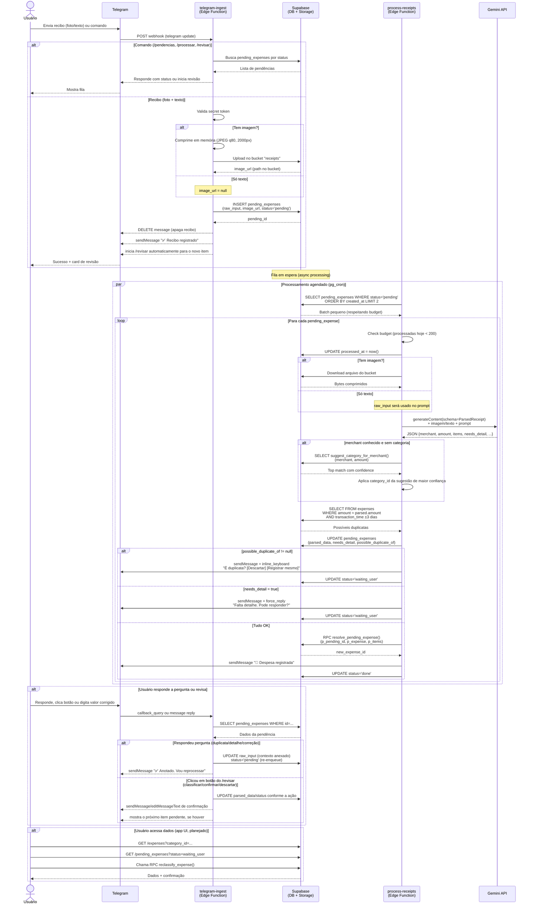
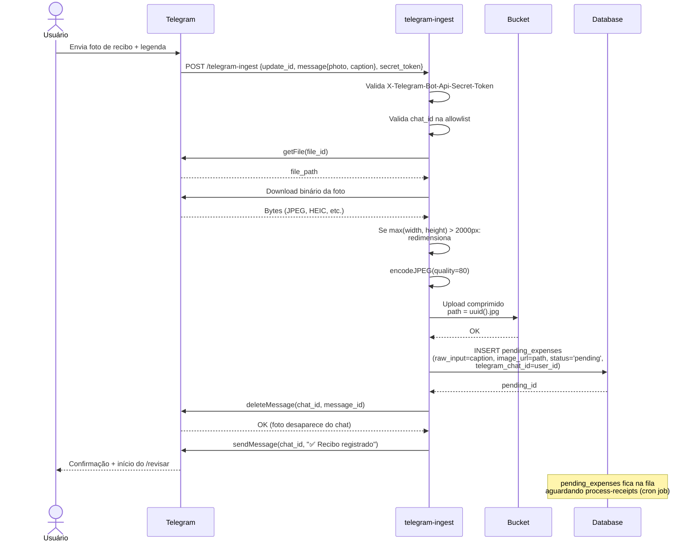
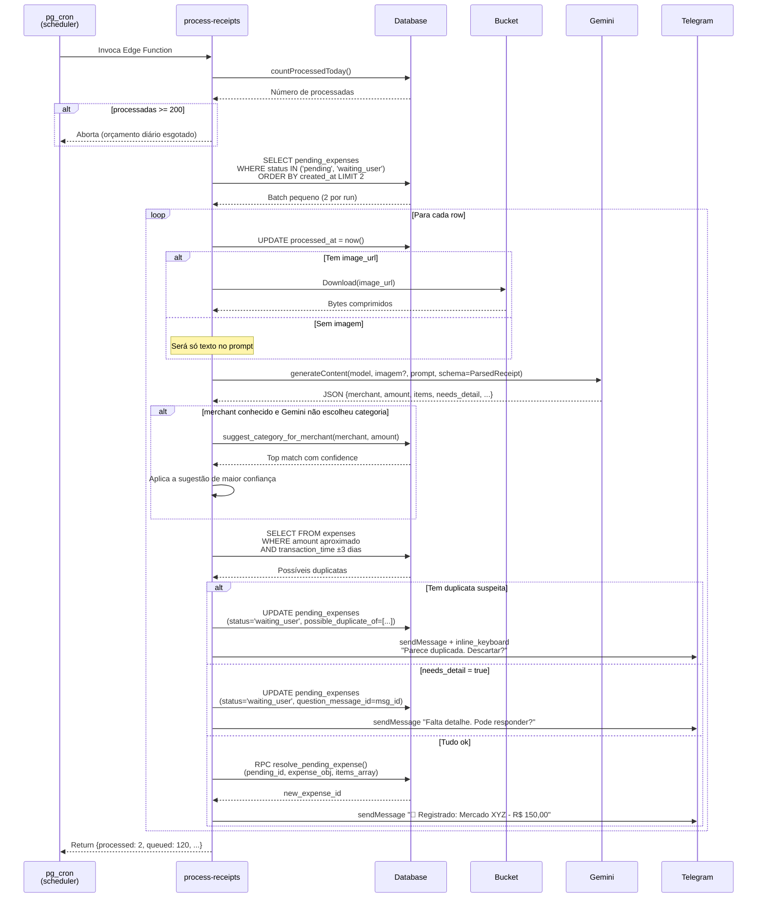
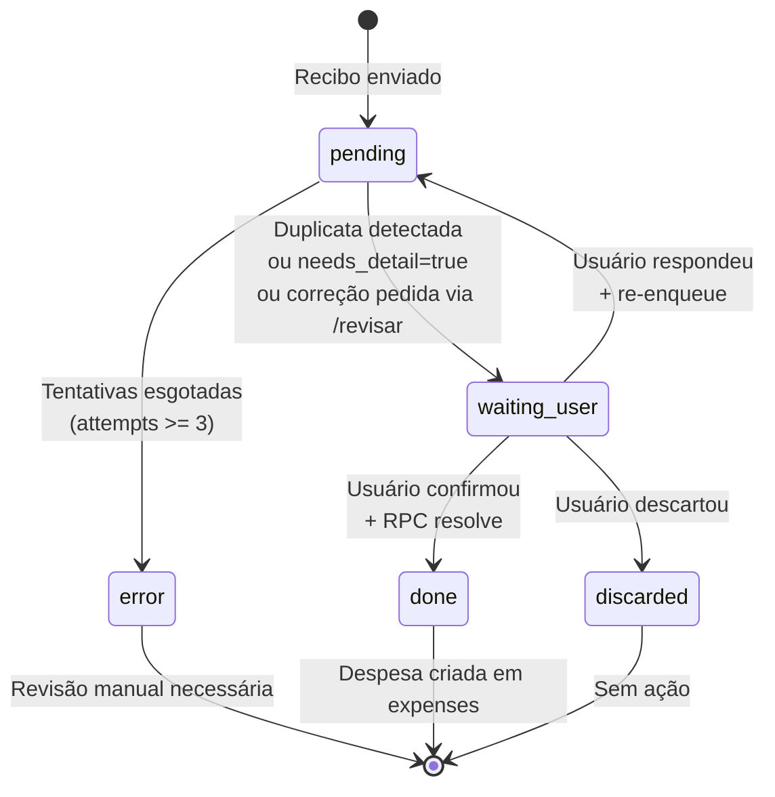

# Fluxos de Interação

Diagramas de sequência do fluxo atualmente implementado (Telegram + Edge Functions + Gemini).

## Fluxo geral do sistema

## Fluxo detalhado: ingestão (telegram-ingest)

## Fluxo detalhado: processamento (process-receipts)

## Fluxo de correção (`/revisar`)

O comando `/revisar` (e o card automático após cada novo recibo) lista as pendências do chat e oferece botões inline:

- **Ver nota** — reenvia a foto do recibo (signed URL) ou o texto original
- **Classificar** — mostra as top-3 sugestões de `suggest_category_for_merchant()` como botões
- **Corrigir valor** — pede um novo valor via `force_reply`; a resposta é capturada como pergunta pendente (`question_message_id` + `status='waiting_user'`) e reprocessada pelo worker com o valor corrigido como contexto
- **Confirmar** — resolve via `resolve_pending_expense()` e mostra o próximo item da fila
- **Mais tarde** — só fecha o card, sem mudar o status
- **Descartar** — marca `status='discarded'` e mostra o próximo item

## Estado das pendências

