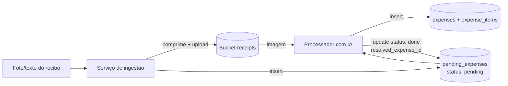
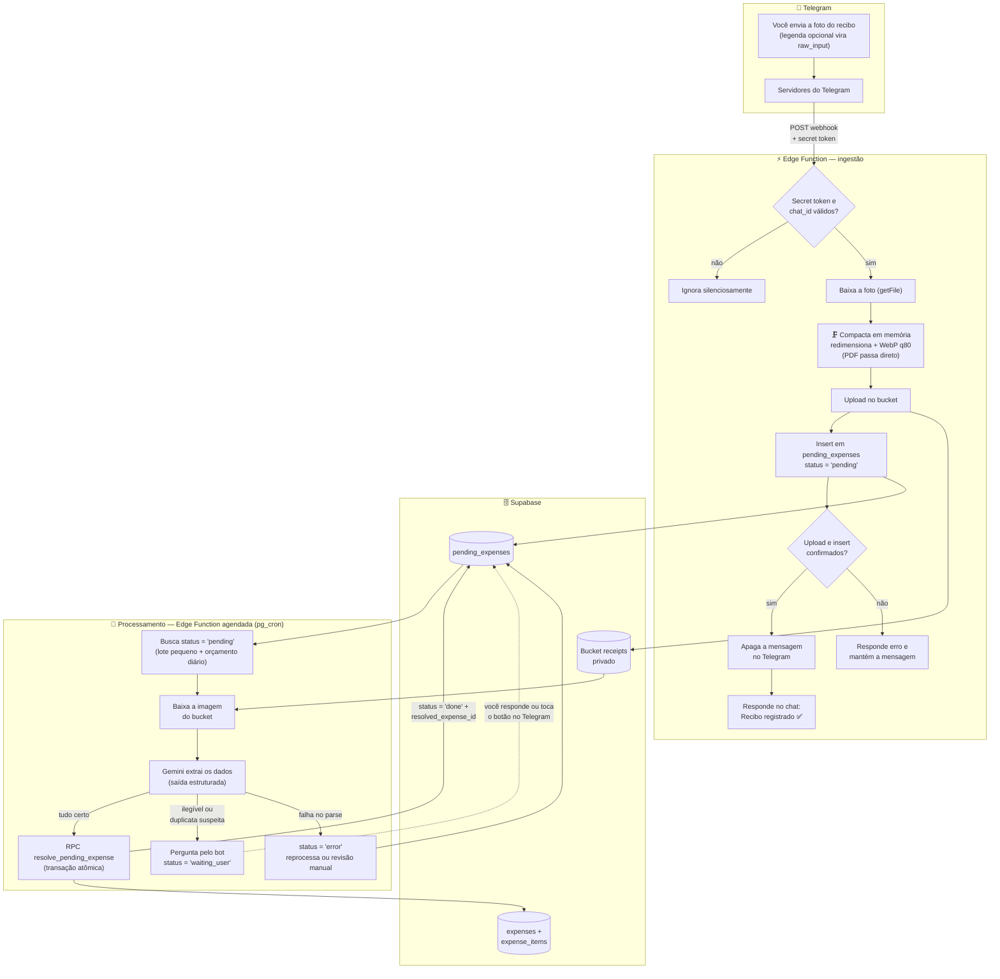

# Pipeline de IA para registro de recibos

Este documento responde duas perguntas de arquitetura do Moneta:

1. Dá para **compactar automaticamente** as imagens antes de salvar no bucket?
2. Como fazer uma IA **(a)** subir o recibo no bucket e registrar em `pending_expenses`, e **(b)** processar a imagem, gravar em `expenses`/`expense_items` e marcar a pendência como `done`?

---

## 1. Compactação automática das imagens

O Supabase Storage **não compacta nada no upload** — ele guarda o arquivo byte a byte como foi enviado. Há três formas de resolver, e a recomendação é a primeira:

### Opção A — Compactar no momento do upload (recomendada)

Quem faz o upload (o serviço de ingestão descrito na seção 2) comprime a imagem antes de enviar. Como todo recibo vai passar por esse serviço, a compactação vira automática por construção.

- **Node**: [`sharp`](https://sharp.pixelplumbing.com/) — redimensionar para no máximo ~2000px no lado maior e converter para WebP/JPEG com qualidade ~80. Um recibo de 8 MB do celular vira algo entre 200–500 KB sem prejudicar a leitura pela IA.
- **Python**: `Pillow` — mesmo princípio (`img.thumbnail((2000, 2000))` + `save(..., quality=80)`).
- **PDFs**: não recomprimir; já costumam ser pequenos e a recompressão pode degradar o texto.

```python
from PIL import Image, ImageOps
import io

def compress_receipt(image_bytes: bytes) -> bytes:
    img = Image.open(io.BytesIO(image_bytes))
    img = ImageOps.exif_transpose(img)  # corrige rotação de fotos de celular
    img.thumbnail((2000, 2000))
    buf = io.BytesIO()
    img.convert("RGB").save(buf, format="WEBP", quality=80)
    return buf.getvalue()
```

### Opção B — Compactar depois do upload (worker)

Um Database Webhook no insert de `pending_expenses` dispara uma Edge Function que baixa a imagem, comprime e regrava. Funciona, mas adiciona uma peça móvel e uma janela em que o arquivo grande existe no bucket. Só vale a pena se o upload for feito direto pelo celular sem passar por um serviço seu.

### Opção C — Image Transformations do Supabase (só para exibição)

O Supabase consegue servir versões redimensionadas/otimizadas na hora do download (`/render/image/...` com `width`/`quality` — recurso do plano Pro). Isso **não reduz o armazenamento** (o original continua lá), mas é útil para exibir thumbnails no app depois. Pode complementar a Opção A, não substituí-la.

---

## 2. O fluxo com IA

Visão geral:



Duas etapas independentes — é exatamente para isso que a tabela `pending_expenses` existe: a ingestão é rápida e burra; o processamento com IA pode rodar depois, reprocessar em caso de erro, etc.

### Etapa 1 — Ingestão (upload + registro em `pending_expenses`)

Um script/serviço com a **`service_role` key** do Supabase (nunca exponha essa chave em cliente/browser — só em backend):

```python
import uuid
from supabase import create_client

supabase = create_client(SUPABASE_URL, SUPABASE_SERVICE_ROLE_KEY)

def ingest_receipt(image_bytes: bytes | None, raw_input: str | None = None) -> str:
    image_url = None
    if image_bytes:
        compressed = compress_receipt(image_bytes)  # seção 1
        path = f"{uuid.uuid4()}.webp"
        supabase.storage.from_("receipts").upload(
            path, compressed, {"content-type": "image/webp"}
        )
        image_url = path  # bucket privado: guarde o path, gere signed URL na leitura

    row = supabase.table("pending_expenses").insert({
        "raw_input": raw_input,
        "image_url": image_url,
        "status": "pending",
    }).execute()
    return row.data[0]["id"]
```

Observação: como o bucket é privado, guarde o **path** do arquivo em `image_url` (não uma URL pública). Para visualizar ou processar, gere uma signed URL temporária: `supabase.storage.from_("receipts").create_signed_url(path, 3600)`.

### Etapa 2 — Processamento (IA lê a imagem e resolve a pendência)

O processador busca as linhas com `status = 'pending'`, envia a imagem (ou o `raw_input`) para o **Gemini** com saída estruturada (`response_schema`) — o que garante um JSON válido no formato das suas tabelas — e grava o resultado.

A escolha pelo **free tier do Gemini** (chave criada no [Google AI Studio](https://aistudio.google.com/)) zera o custo do processamento. Dois pontos de atenção:

- **Limites do free tier**: há tetos de requisições por minuto e por dia (na casa de algumas centenas/dia para o `gemini-2.5-flash`; os números mudam — confira em [ai.google.dev/pricing](https://ai.google.dev/gemini-api/docs/pricing)). Para recibos pessoais, sobra folga.
- **Privacidade**: no free tier, o Google pode usar os dados enviados para melhorar seus produtos (no tier pago, não). Como são recibos de compra, é o mesmo trade-off já aceito no transporte pelo Telegram — mas vale saber que a troca por um tier pago (de qualquer provedor) remove esse uso.

```python
from google import genai
from google.genai import types
from pydantic import BaseModel

class ExpenseItem(BaseModel):
    description: str
    quantity: float | None
    unit_price: float | None
    total: float | None

class ParsedReceipt(BaseModel):
    merchant: str | None
    transaction_time: str | None  # ISO 8601; None se ilegível
    amount: float
    currency: str                 # ex.: "BRL"
    items: list[ExpenseItem]      # vazio se o recibo não discriminar itens
    needs_detail: bool            # True se algo importante estiver ilegível
    notes: str | None

client = genai.Client()  # GEMINI_API_KEY no ambiente

def parse_receipt_image(image_bytes: bytes, mime_type: str) -> ParsedReceipt:
    response = client.models.generate_content(
        model="gemini-2.5-flash",
        contents=[
            types.Part.from_bytes(data=image_bytes, mime_type=mime_type),
            (
                "Extraia os dados deste recibo. Valores em formato numérico, "
                "data/hora em ISO 8601 com timezone de São Paulo quando o recibo "
                "não indicar outro. Liste cada item quando o recibo discriminar; "
                "se um campo estiver ilegível, use null e marque needs_detail."
            ),
        ],
        config={
            "response_mime_type": "application/json",
            "response_schema": ParsedReceipt,
        },
    )
    return response.parsed
```

Com o resultado em mãos, gravar `expenses` + `expense_items` + atualizar a pendência. Para isso ser **atômico** (ou grava tudo, ou nada), o ideal é uma função Postgres chamada via RPC:

```sql
create or replace function public.resolve_pending_expense(
  p_pending_id uuid,
  p_expense jsonb,
  p_items jsonb
) returns uuid
language plpgsql
security definer
as $$
declare
  v_expense_id uuid;
begin
  insert into public.expenses (transaction_time, merchant, amount, currency, source, notes)
  values (
    coalesce((p_expense->>'transaction_time')::timestamptz, now()),
    p_expense->>'merchant',
    (p_expense->>'amount')::numeric,
    coalesce(p_expense->>'currency', 'BRL'),
    'ai_pipeline',
    p_expense->>'notes'
  )
  returning id into v_expense_id;

  insert into public.expense_items (expense_id, description, quantity, unit_price, total)
  select v_expense_id,
         item->>'description',
         (item->>'quantity')::numeric,
         (item->>'unit_price')::numeric,
         (item->>'total')::numeric
  from jsonb_array_elements(p_items) as item;

  update public.pending_expenses
  set status = 'done',
      resolved_expense_id = v_expense_id,
      parsed_data = p_expense || jsonb_build_object('items', p_items)
  where id = p_pending_id;

  return v_expense_id;
end;
$$;
```

E no Python o fechamento do ciclo fica em uma chamada:

```python
def process_pending(pending: dict) -> None:
    signed = supabase.storage.from_("receipts").create_signed_url(pending["image_url"], 600)
    image_bytes = httpx.get(signed["signedURL"]).content

    parsed = parse_receipt_image(image_bytes, "image/webp")

    supabase.rpc("resolve_pending_expense", {
        "p_pending_id": pending["id"],
        "p_expense": parsed.model_dump(exclude={"items"}),
        "p_items": [i.model_dump() for i in parsed.items],
    }).execute()
```

### Onde rodar cada etapa

| Opção | Como funciona | Quando escolher |
|---|---|---|
| **Edge Function agendada (pg_cron)** — **escolhida** | O worker `process-receipts` roda em intervalos fixos, processa um lote pequeno da fila e respeita um orçamento diário (limites do free tier do Gemini) | Zero infraestrutura extra, tudo dentro do Supabase — implementada em `supabase/functions/process-receipts/` |
| **Script local / cron** | Um script Python roda sob demanda ou a cada X minutos, ingere e processa o que estiver pendente | Alternativa simples se preferir rodar da sua máquina |
| **Edge Function + Database Webhook** | Insert em `pending_expenses` dispara webhook → Edge Function chama a IA e resolve na hora | Quando quiser processamento imediato em vez de fila com cadência |
| **Automação (n8n / bot Telegram)** | Você manda a foto num chat, o bot faz a ingestão; o processamento roda como acima | Se quiser registrar recibos pelo celular antes do app ficar pronto |

---

## 3. Fluxo completo via Telegram

Decisões tomadas:

- A mensagem com a foto é **apagada do Telegram somente após confirmação** de que o arquivo foi salvo no bucket e a linha criada em `pending_expenses`. Se algo falhar, a mensagem permanece no chat e o bot responde com erro.
- **Onde a compactação acontece**: dentro da Edge Function de ingestão, **em memória**, entre o download da foto do Telegram e o upload no bucket. O arquivo original nunca é gravado em lugar nenhum — o bucket só recebe a versão compactada. Observações:
  - Edge Functions rodam **Deno**, então `sharp`/`Pillow` não se aplicam ali; usa-se uma biblioteca WASM (ex.: `ImageScript` ou `@jsquash/webp`).
  - Fotos enviadas como "foto" no Telegram já chegam recomprimidas pelo próprio Telegram (JPEG, lado maior ≤ ~2560px); a função compacta mesmo assim para normalizar em WebP e cobrir o caso de envio como **documento** (que preserva o original) ou PDF (que passa direto, sem recompressão).



Notas de implementação:

- **Duplicatas**: antes de resolver, o processador pode consultar `expenses` recentes (mesmo valor ± data próxima) e, em caso de suspeita, preencher `possible_duplicate_of` e deixar `status = 'needs_review'` em vez de resolver automaticamente.
- **Campos que a IA não resolve sozinha**: `payment_method_id` e `category_id` dependem de cadastro seu. Dá para passar a lista de `payment_methods`/`categories` no prompt e pedir que o modelo escolha o `id` mais provável — ou deixar null e classificar depois.
- **Reprocessamento**: se o parse falhar, marque `status = 'error'` e guarde o motivo em `parsed_data`; o próximo ciclo pode tentar de novo ou você resolve manualmente.
- **Chaves**: `SUPABASE_SERVICE_ROLE_KEY` e `GEMINI_API_KEY` ficam só no ambiente do backend/script — nunca no app cliente.
